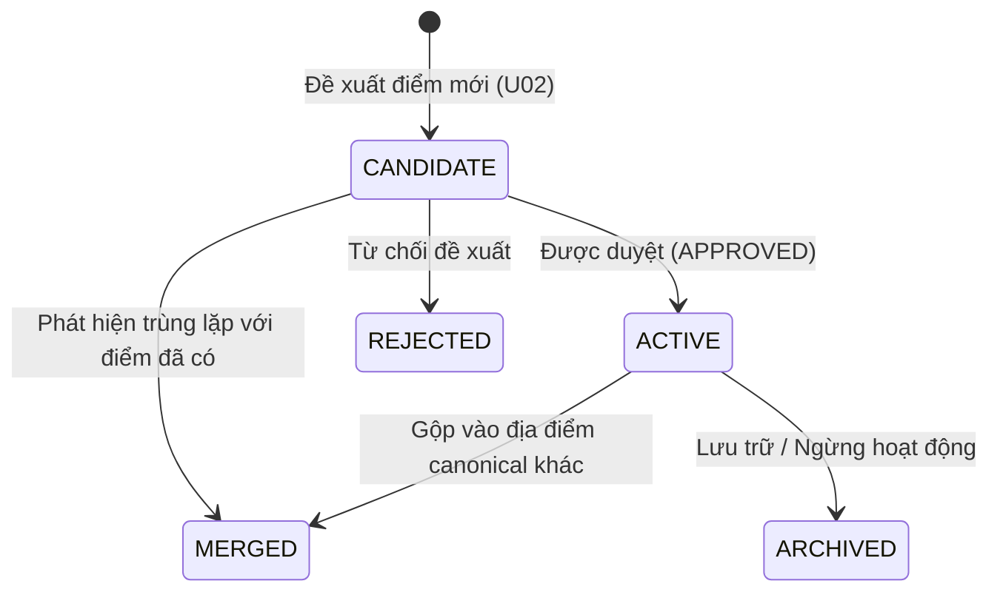
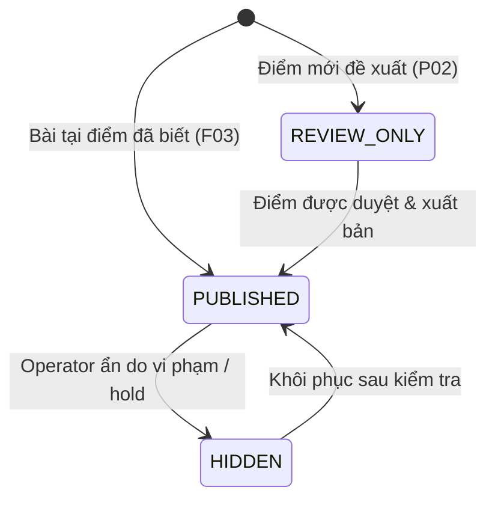
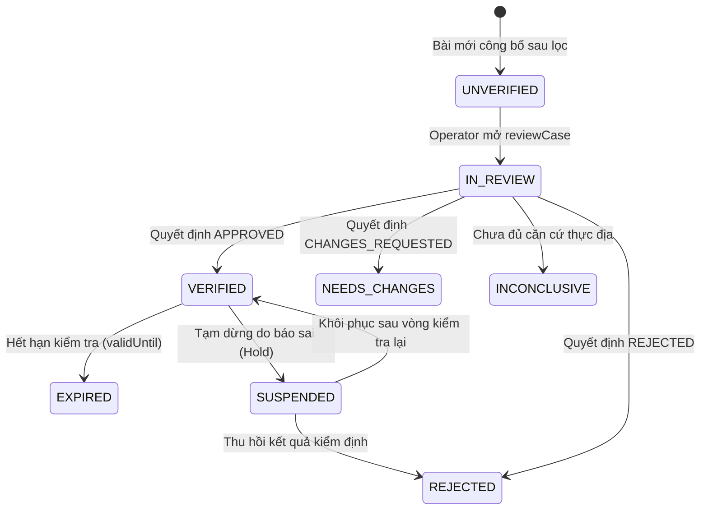
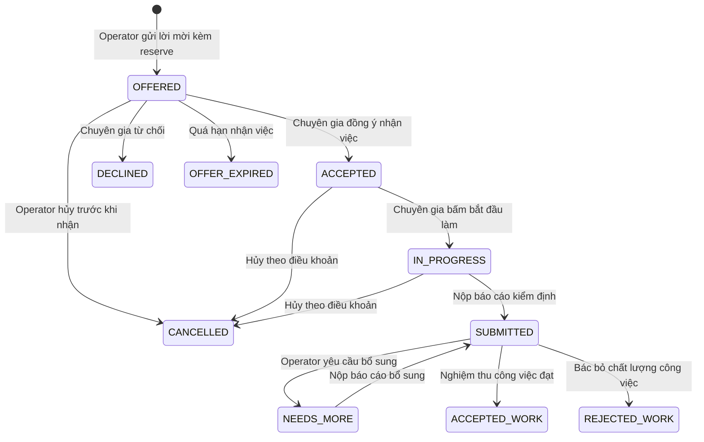
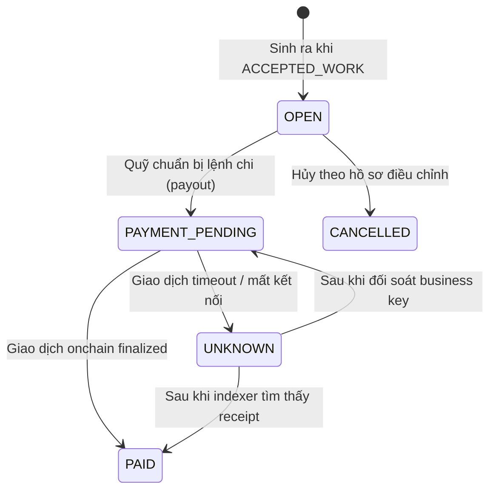
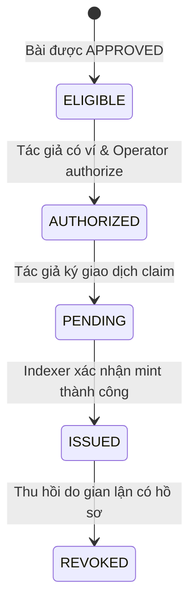
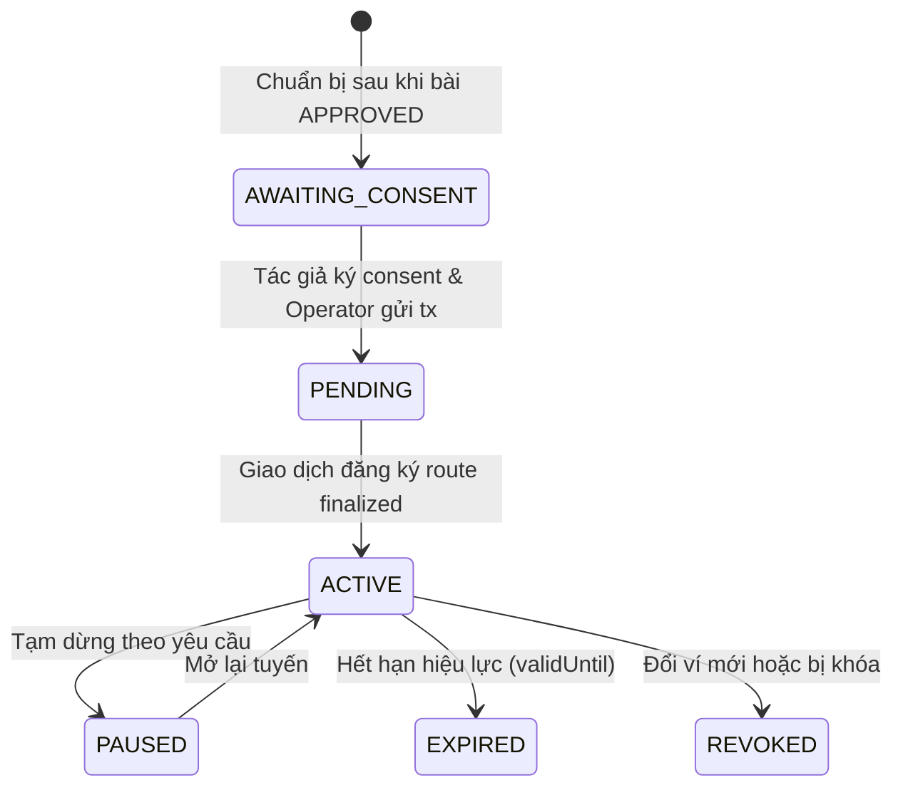
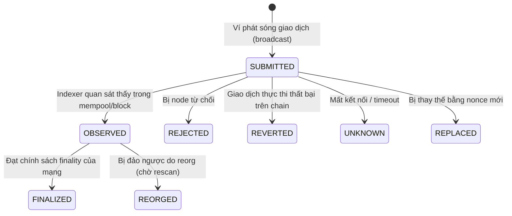
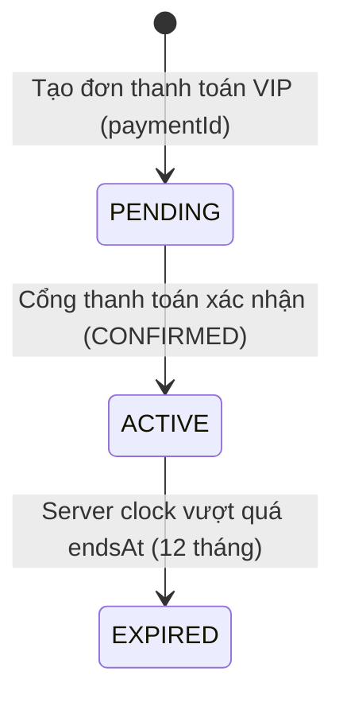

# Các Máy Trạng Thái Thực Thể (STATE_MACHINES)

Tài liệu này định nghĩa độc lập các máy trạng thái theo `Ventlore_Logic_ID_DB_v0_3.pdf` (Mục 09) và `Ventlore_Event_UI_Spec_v0_3.pdf` (Mục 07).

> [!IMPORTANT]
> Tuyệt đối không gộp chung các trục trạng thái khác nhau (như visibility, accessTier, verification, task work, payable, grant, route) thành một huy hiệu hoặc một cột enum duy nhất.

---

## 1. Vòng Đời Địa Điểm (Place Lifecycle)

Áp dụng cho bảng `places` (`placeId`).

- **`CANDIDATE`**: Điểm mới được đề xuất; chưa công nhận; chưa công khai thông tin chi tiết.
- **`ACTIVE`**: Điểm đến hợp lệ, có bài viết nguồn đã được duyệt.
- **`MERGED`**: Điểm trùng lặp; trỏ `canonical_place_id` về địa điểm gốc, không có chu trình.
- **`REJECTED`**: Đề xuất không đạt yêu cầu hoặc không có thực.
- **`ARCHIVED`**: Địa điểm ngừng tiếp cận hoặc lưu trữ.

---

## 2. Quyền Hiển Thị Bài Viết (Visibility)

Áp dụng cho bảng `posts` (`postId`).

- **`REVIEW_ONLY`**: Chỉ tác giả và người có thẩm quyền kiểm duyệt xem được nội dung.
- **`PUBLISHED`**: Đã xuất bản công khai cho mọi người đọc.
- **`HIDDEN`**: Tạm ẩn khỏi danh mục công khai.

---

## 3. Phân Cấp Truy Cập (Access Tier)

Áp dụng cho nội dung bài viết (`posts`/`revisions`).

- **`PUBLIC`**: Khách và thành viên đọc tự do; bao gồm thông tin tóm tắt, điều kiện tiếp cận cơ bản, và các cảnh báo an toàn bắt buộc.
- **`VIP`**: Hướng dẫn chuyên sâu tuyển chọn; chỉ thành viên có gói VIP còn hạn mới đọc được. Server kiểm tra quyền trước khi trả dữ liệu.

---

## 4. Trạng Thái Kiểm Định Nội Dung (Verification Status)

Gắn chặt với từng phiên bản nội dung (`revisions.revision_id`), không gắn theo bài viết hay tác giả.

---

## 5. Nhiệm Vụ Của Chuyên Gia (Task Work Status)

Áp dụng cho bảng `tasks` (`taskId`).

---

## 6. Nghĩa Vụ Trả Thù Lao (Payable Status)

Áp dụng cho bảng `payables` (`payableId`). Độc lập với quyết định nội dung bài viết.

---

## 7. Cấp Quyền Token (Grant SBT / NFT)

Áp dụng cho bảng `credentials` (`credentialId`) và `author_collectibles` (`collectibleId`).

---

## 8. Tuyến Nhận Tip (Tip Route Status)

Áp dụng cho bảng `tip_routes` (`routeId`).

---

## 9. Lần Gửi Giao Dịch Blockchain (Transaction Attempt Status)

Áp dụng cho bảng `transaction_attempts` (`attemptId`).

---

## 10. Gói Thành Viên VIP (Membership Term Status)

Áp dụng cho bảng `membership_terms` theo `paymentId`.

