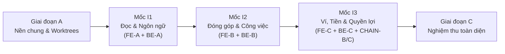

# Ventlore Acceptance Criteria & Integration Milestones (ACCEPTANCE.md)

**Phiên bản:** 2.0  
**Ngày thiết lập:** 25/09/2026  
**Chủ trì:** Integration Coordinator (Merge Lane)  
**Tài liệu điều phối:** `docs/prompts/Ventlore_04_Merge_Parallel_v2.md`  

---

## 1. Ba Mốc Tích Hợp Chính (Integration Milestones I1, I2, I3)

### 1.1 Mốc I1 — Đọc và Ngôn Ngữ
- **Điều kiện đầu vào:** FE hoàn thành FE-A; BE hoàn thành BE-A (Route Handlers API đọc & schema PostgreSQL).
- **Phạm vi kiểm tra:**
  1. Luồng duyệt: Home (`/`) → Explore (`/explore`) → Chi tiết địa điểm (`/places/[placeId]`) → Bài viết (`/posts/[postId]`) → Hồ sơ tác giả (`/people/[handle]`) hoạt động trên API và PostgreSQL thật tại local.
  2. Đa ngôn ngữ: Đủ 6 ngôn ngữ (`vi`, `en`, `ja`, `zh-Hans`, `ko`, `fr`), chuyển đổi locale giữ nguyên context URL, bộ lọc, từ khóa và ID phiên bản.
  3. Tìm kiếm & Canonical: Tìm kiếm không dấu (ví dụ `cat ba` tìm ra Cát Bà), địa điểm sáp nhập (`PLC-000002` hiển thị banner sáp nhập vào `PLC-000001` và không đếm trùng).
  4. Quyền riêng tư: Dữ liệu bài viết bí mật/VIP (`PST-000004`) không bị rò rỉ trong HTML/JSON/cache của người dùng Guest.

### 1.2 Mốc I2 — Đóng Góp và Công Việc
- **Điều kiện đầu vào:** FE hoàn thành FE-B (S06–S12, S17–S19, S24–S27, S30, S31, S35); BE hoàn thành BE-B (Nghiệp vụ bài viết, review case, task, submission, decision, payable).
- **Phạm vi kiểm tra:**
  1. Luồng đề xuất điểm mới: Tạo đồng thời `placeId` (CANDIDATE) + `postId` (DISCOVERY) + `revisionId` trong transaction; trạng thái là `REVIEW_ONLY` trước khi được duyệt.
  2. Kiểm tra trùng lặp: Cảnh báo gợi ý khi tạo điểm trùng, không tự ý chặn thao tác.
  3. Đánh giá độc lập (Review Case): Tự động phát hiện xung đột lợi ích, cấm tác giả tự duyệt bài của mình (Self-review check), thiếu chuyên gia giữ trạng thái `WAITING_CAPACITY`.
  4. Hai quyết định độc lập: Bài viết bị từ chối (`REJECTED`) nhưng chuyên gia làm việc đúng quy trình vẫn được nghiệm thu (`ACCEPTED_WORK`) và phát sinh nghĩa vụ trả công (`payableId`).
  5. Bảo mật bằng chứng: Quá trình blind review chỉ hiển thị bằng chứng cho người được phân công.

### 1.3 Mốc I3 — Ví, Tiền và Quyền Lợi
- **Điều kiện đầu vào:** FE hoàn thành FE-C; BE hoàn thành BE-C; CHAIN hoàn thành CHAIN-B và CHAIN-C; ABI và Manifest đồng bộ 100%.
- **Phạm vi kiểm tra:**
  1. Liên kết ví: Ký thông điệp xác thực liên kết ví (EIP-712 challenge) không đổi `userId`.
  2. Phân bổ tài chính:
     - `PROJECT`: 100% số tiền chuyển vào quỹ cộng đồng.
     - `POST_TIP`: 80% tác giả, 20% quỹ dự án (`projectAmount = floor(amount / 5)`, `authorAmount = amount - projectAmount`), gas riêng biệt.
     - Số tiền tính bằng `atomic units` (chuỗi BigInt), không dùng số thực float.
  3. Bốn nhánh sau duyệt độc lập: Khi bài viết được `APPROVED`, kích hoạt độc lập: Nhãn xác minh, Contributor SBT claim, Author NFT claim (tối đa 1 NFT `AUTHOR_CONTRIBUTION`/post) và Đăng ký route nhận tip.
  4. Indexer & Sổ quỹ: Worker phát hiện sự kiện onchain trên Anvil local, cập nhật trạng thái phiếu thu và sổ quỹ minh bạch (`/transparency`).
  5. VIP Adapter: Kích hoạt kỳ hạn 12 tháng lịch UTC, kiểm tra tính toán ngày nhuận 29/2 và chống gia hạn trùng lặp.

---

## 2. Tiêu Chuẩn Phân Loại Kết Quả Nghiệm Thu

Mọi báo cáo nghiệm thu phải phân tách rõ ràng hai chiều:

1. **Trạng thái thực thi:**
   - `PASS`: Đã kiểm tra thực tế bằng lệnh hoặc browser script và đạt 100% tiêu chí.
   - `FAIL`: Đã chạy kiểm tra nhưng kết quả không khớp đặc tả (kèm log lỗi cụ thể).
   - `NOT_RUN`: Chưa chạy kiểm tra trong lượt này.
   - `NOT_CONFIGURED`: Tính năng phụ thuộc bên thứ 3 (OAuth production, Arbitrum Sepolia live, Stripe checkout) chưa cấu hình khóa bí mật.
2. **Tầng môi trường thực tế:**
   - `MOCK`: Chạy trên dữ liệu giả lập in-memory.
   - `LOCAL_REAL`: Chạy trên dịch vụ thật tại local (Next.js server, PostgreSQL instance, Anvil node).
   - `TESTNET_REAL`: Đã broadcast và quan sát thực tế trên Arbitrum Sepolia.
